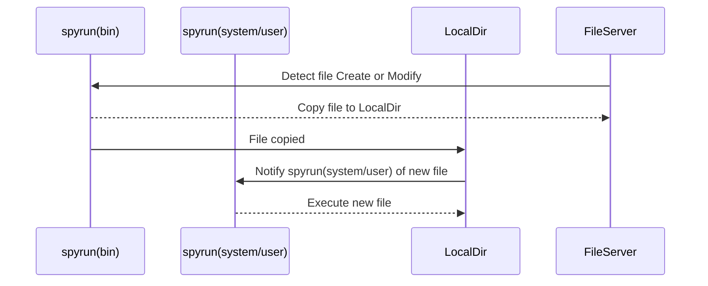
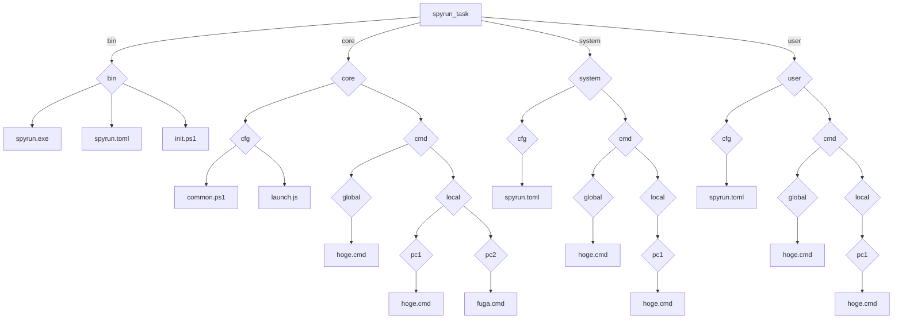
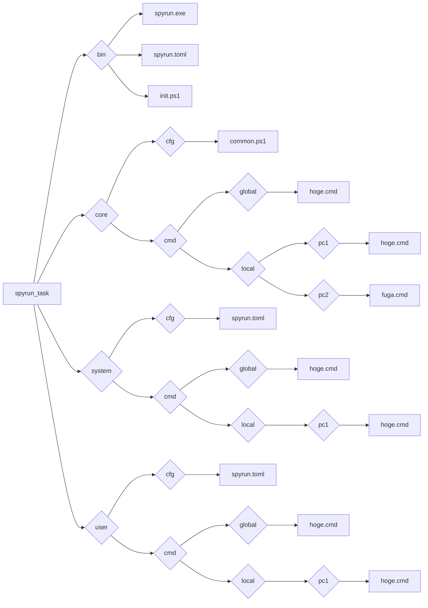

Task with [yukimemi/spyrun: Check file notify and run.](https://github.com/yukimemi/spyrun)

## Directory struct.

### Remote

- spyrun_task
  - bin
    - spyrun.exe
    - spyrun.toml
    - init.ps1
  - core
    - cfg
      - common.ps1
    - cmd
      - global
        - hoge.cmd
      - local
        - pc1
          - hoge.cmd
        - pc2
          - fuga.cmd
  - system
    - cfg
      - spyrun.toml
    - cmd
      - global
        - hoge.cmd
      - local
        - pc1
          - hoge.cmd
  - user
    - cfg
      - spyrun.toml
    - cmd
      - global
        - hoge.cmd
      - local
        - pc1
          - hoge.cmd

